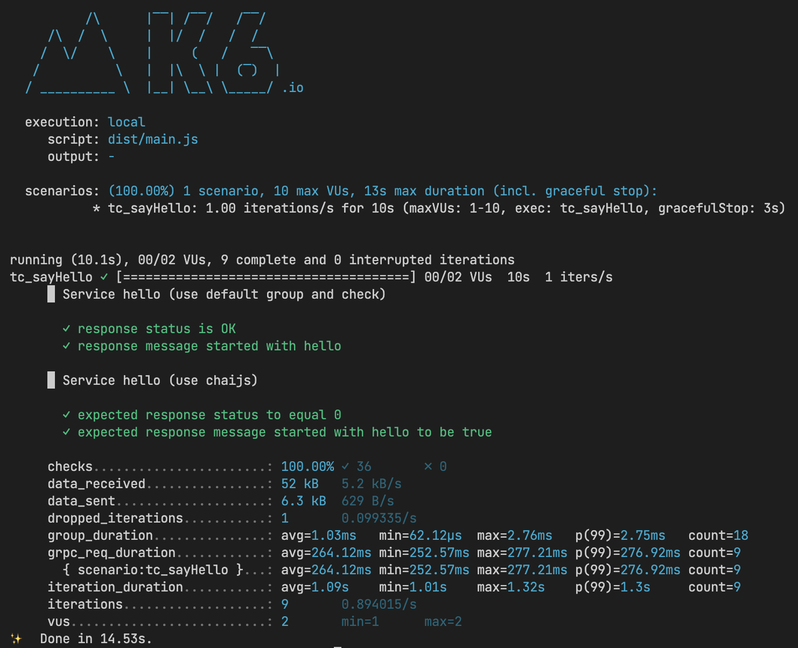

# Template to use TypeScript with k6

This repository provides a template project to start using TypeScript in your k6 scripts:

- Seperate test case, test data, test environment, test options
- Pre-commit check style and format

## Prerequisites

- [k6](https://k6.io/docs/getting-started/installation)
- [NodeJS](https://nodejs.org/en/download/)
- [Yarn](https://yarnpkg.com/getting-started/install)

## Installation

**Install dependencies**

Clone the generated repository on your local machine, move to the project root folder and install the dependencies defined

```bash
yarn install
```

**Run the demo test**

```bash
yarn k6:demo
```


